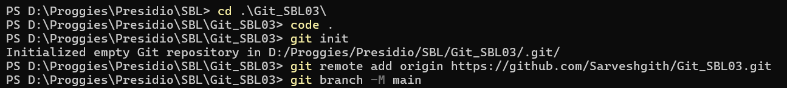
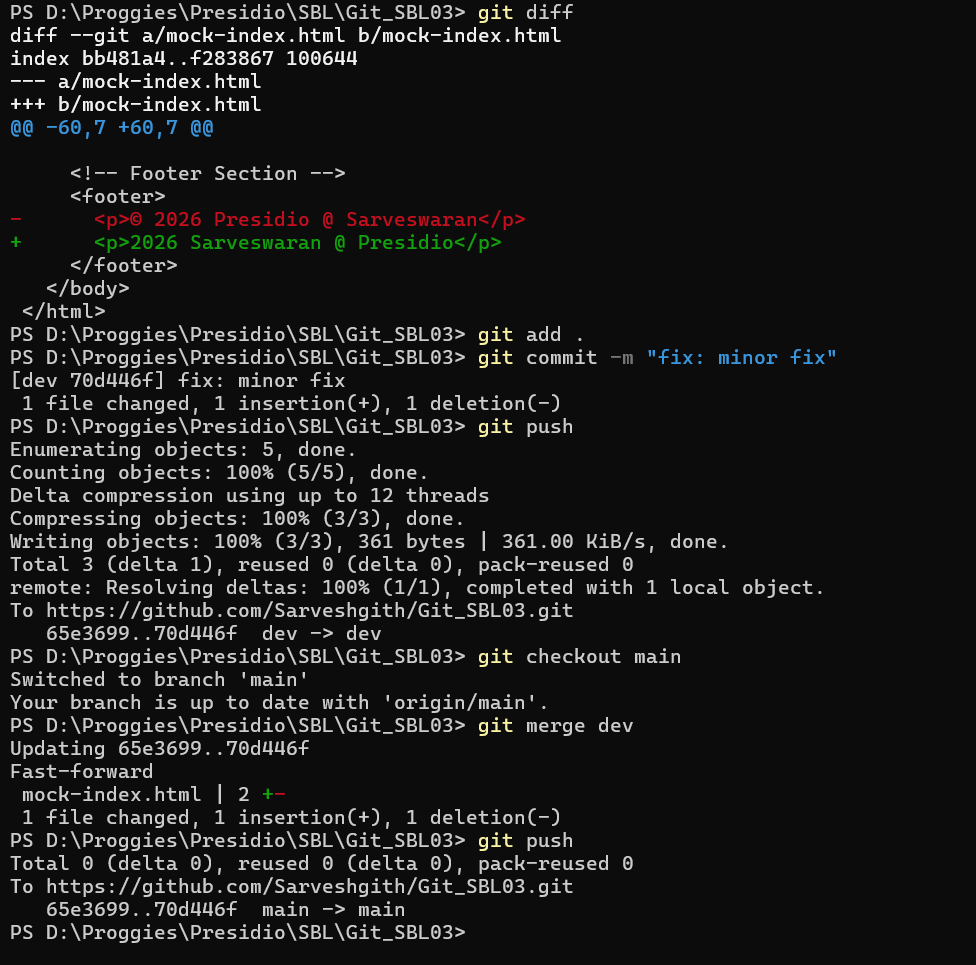

# 📘 Git Task 01 – Initialize, Commit, and Branch Basics

## 🎯 Objective

The objective of this task is to understand and implement the fundamental Git workflow, including:

* Initializing a Git repository
* Creating and committing files
* Working with branches
* Merging changes back into the main branch
* Verifying commit history

---

## 🛠️ Steps Performed

### 1. Initialize Repository

A new Git repository was initialized using:

```bash
git init
```

The default branch was renamed to `main`:

```bash
git branch -M main
```

---

### 2. Add Remote Repository

Connected the local repository to a remote GitHub repository:

```bash
git remote add origin https://github.com/Sarveshgith/Git_SBL03.git
```

---

### 3. Create and Commit Files

* Created project files (`mock-index.html`, `mock-styles.css`)
* Added them to staging:

```bash
git add .
```

* Committed changes:

```bash
git commit -m "feat: added mock files for testing"
```

---

### 4. Create and Work on a New Branch

A new branch `dev` was created and switched to:

```bash
git checkout -b dev
```

* Made changes to existing files
* Verified changes using:

```bash
git diff
```

* Staged and committed updates:

```bash
git add .
git commit -m "fix: minor fix"
```

---

### 5. Push Changes to Remote

Pushed the `dev` branch to GitHub:

```bash
git push -u origin dev
```

---

### 6. Merge Branch into Main

* Switched back to the main branch:

```bash
git checkout main
```

* Merged the `dev` branch into `main`:

```bash
git merge dev
```

* Pushed updated main branch:

```bash
git push origin main
```

---

### 7. Verify Commit History

Commit history was verified using:

```bash
git log --oneline --graph --all
```

This confirms:

* Initial commit
* Feature updates in `dev`
* Successful merge into `main`

---

📸 Output:





---

## ✅ Outcome

* Successfully initialized a Git repository
* Created and committed files
* Implemented branching workflow
* Merged changes from a feature branch (`dev`) into `main`
* Synced all changes with the remote repository

---

## 🧠 Key Learnings

* Importance of branching for isolated development
* Difference between staging and committing
* How merging integrates changes across branches
* Understanding Git history and commit tracking

---

## 🚀 Conclusion

This task demonstrates the foundational Git workflow used in real-world development environments. Mastering these basics is essential for effective collaboration, version control, and maintaining clean project history.

---
