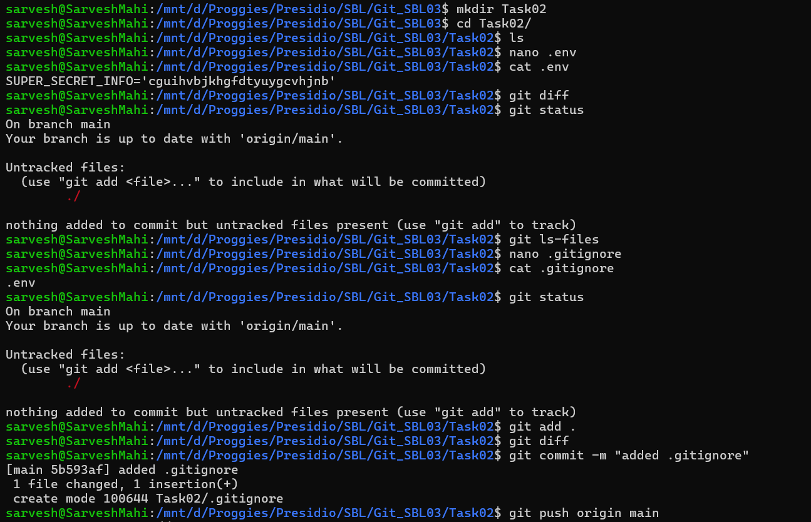

# 📘 Git Task 02 – Using `.gitignore` and Tracking Files

## 🎯 Objective

The objective of this task is to understand how Git handles file tracking and how to exclude specific files or directories using a `.gitignore` file.

---

## 🛠️ Steps Performed

### 1. Create Task Directory

A new directory for the task was created:

```bash
mkdir Task02
cd Task02
```

---

### 2. Create a Sensitive File

A `.env` file was created to simulate storing sensitive data:

```bash
nano .env
```

Content added:

```text
SUPER_SECRET_INFO=cguihvbjkhgfdtyuygcvhjnb
```

Verified using:

```bash
cat .env
```

---

### 3. Check Git Status Before `.gitignore`

```bash
git status
```

👉 Output showed:

* `.env` was **untracked**
* Git was ready to track it if added

---

### 4. Create `.gitignore`

```bash
nano .gitignore
```

Added the following rule:

```text
.env
```

Verified:

```bash
cat .gitignore
```

---

### 5. Verify Ignored Files

```bash
git status
```

👉 Result:

* `.env` **did NOT appear**
* Confirming it is successfully ignored by Git

---

### 6. Track `.gitignore` File

```bash
git add .
git commit -m "added .gitignore"
```

---

### 7. Push Changes to Remote

```bash
git push origin main
```

---

📸 Output:



---

## ✅ Outcome

* Successfully created a `.gitignore` file
* Prevented `.env` (sensitive file) from being tracked
* Verified ignored files using `git status`
* Committed only necessary files to the repository

---

## 🧠 Key Learnings

* `.gitignore` helps prevent committing sensitive or unnecessary files
* Files listed in `.gitignore` will not appear in `git status`
* `.env` files should **always be ignored** in real-world projects
* Git only ignores files that are **not already tracked**

---

## ⚠️ Important Note

If a file is already tracked before adding it to `.gitignore`, it will continue to be tracked.

To fix this:

```bash
git rm --cached .env
```

---

## 🚀 Conclusion

This task demonstrates how to manage file tracking effectively using `.gitignore`. It is a critical practice in real-world development to protect sensitive data and keep repositories clean.

---
