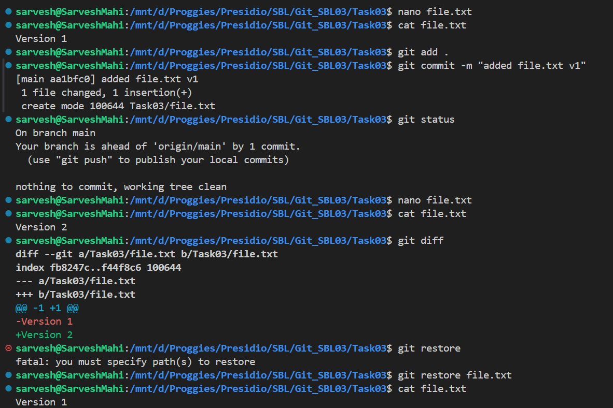
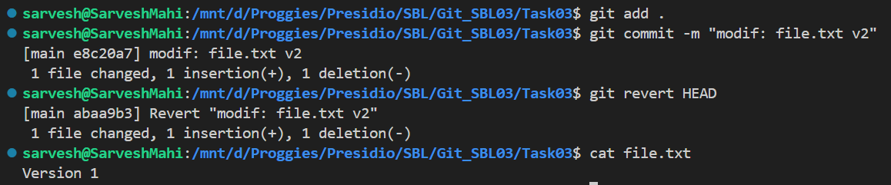
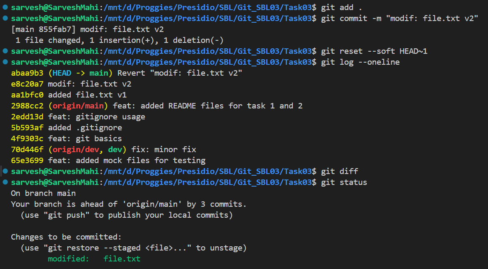

# 📘 Git Task 03 – Undoing Changes and Reverting Commits

## 🎯 Objective

The objective of this task is to experiment with undoing changes in Git, both in the working directory and after commits, and understand the differences between various undo mechanisms.

---

## 🛠️ Steps Performed

---

### 1. Modify File and Undo Using `git restore`

A tracked file (`file.txt`) was modified from:

```
Version 1
```

to:

```
Version 2
```

Changes were inspected using:

```bash
git diff
```

Then, the changes were undone using:

```bash
git restore file.txt
```

📸 Output:



---

### 2. Commit Changes and Undo Using `git revert`

The modified file was committed:

```bash
git add .
git commit -m "modif: file.txt v2"
```

Then, the commit was safely undone using:

```bash
git revert HEAD
```

This created a new commit that reversed the previous changes.

📸 Output:



---

### 3. Undo Commit Using `git reset --soft`

A commit was made again and then undone using:

```bash
git reset --soft HEAD~1
```

👉 Effect:

* The commit was removed
* Changes remained in the staging area

Verification was done using:

```bash
git status
git log --oneline
```

📸 Output:



---

## ✅ Outcome

* Successfully reverted uncommitted changes using `git restore`
* Safely undid a commit using `git revert`
* Explored commit removal using `git reset --soft`
* Verified all operations using Git commands

---

## 🧠 Key Differences

| Command              | Purpose            | Behavior                     |
| -------------------- | ------------------ | ---------------------------- |
| `git restore <file>` | Undo local changes | Discards uncommitted changes |
| `git revert`         | Safe undo          | Creates a new commit         |
| `git reset --soft`   | Undo commit        | Keeps changes staged         |
| `git reset`          | Undo commit        | Keeps changes unstaged       |
| `git reset --hard`   | Dangerous          | Deletes commit + changes     |

---

## ⚠️ Important Notes

* Use `git revert` when working with shared or pushed commits
* Use `git reset` only for local changes
* Avoid `git reset --hard` unless absolutely necessary

---

## 🚀 Conclusion

This task demonstrates multiple ways to undo changes in Git. Understanding these methods helps maintain a clean and safe version control workflow in real-world development.

---
