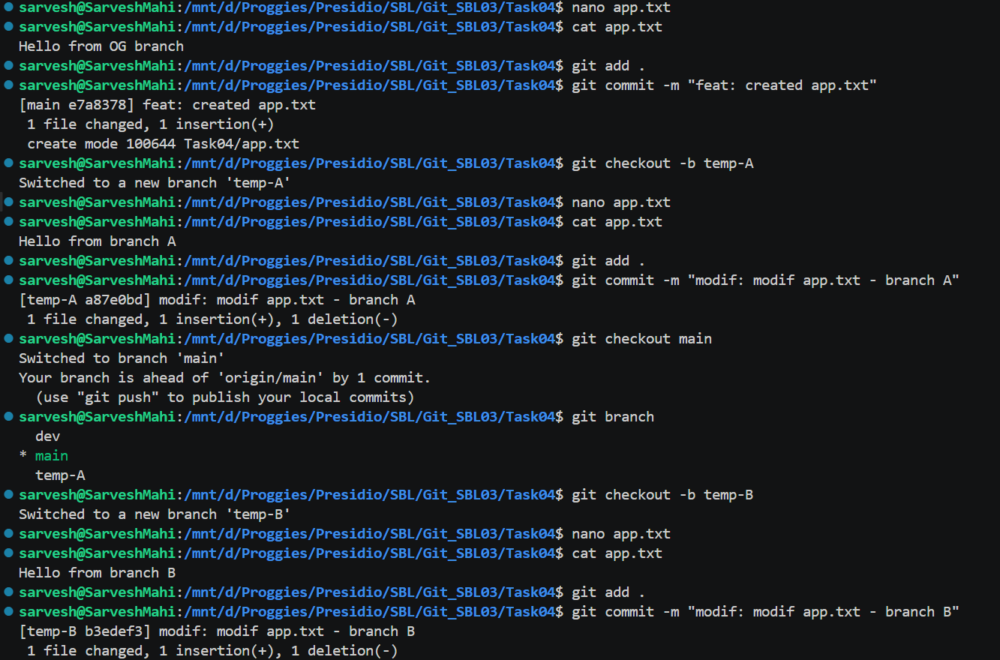
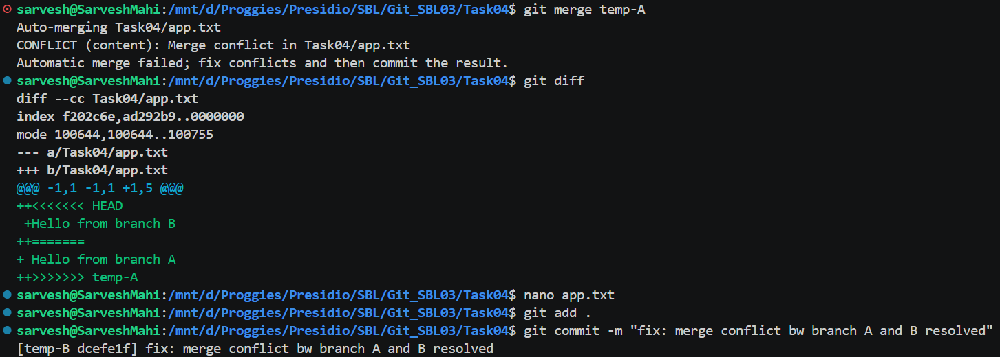
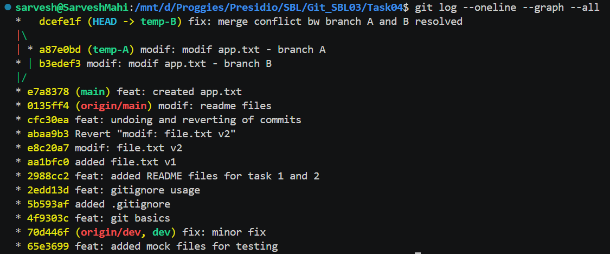

# 📘 Git Task 04 – Simulating and Resolving Merge Conflicts

## 🎯 Objective

The objective of this task is to create a merge conflict scenario and resolve it manually using Git tools like `git status` and `git diff`.

---

## 🛠️ Steps Performed

---

### 1. Create Base File and Commit

A common file `app.txt` was created in the main branch:

```bash
nano app.txt
cat app.txt
```

Content:

```text
Hello from OG branch
```

Then committed:

```bash
git add .
git commit -m "feat: created app.txt"
```

---

### 2. Create First Branch and Modify File

Created branch `temp-A`:

```bash
git checkout -b temp-A
```

Modified file:

```text
Hello from branch A
```

Committed:

```bash
git add .
git commit -m "modif: modif app.txt - branch A"
```

---

### 3. Create Second Branch from Same Base

Switched back to main and created `temp-B`:

```bash
git checkout main
git checkout -b temp-B
```

Modified the same line:

```text
Hello from branch B
```

Committed:

```bash
git add .
git commit -m "modif: modif app.txt - branch B"
```

📸 Output:



---

### 4. Merge and Trigger Conflict

Attempted to merge `temp-A` into `temp-B`:

```bash
git merge temp-A
```

👉 Git produced a conflict:

```text
CONFLICT (content): Merge conflict in app.txt
Automatic merge failed; fix conflicts and then commit the result.
```
---

### 5. Identify Conflict

Checked status:

```bash
git status
```

Checked differences:

```bash
git diff
```

Conflict markers in file:

```text
<<<<<<< HEAD
Hello from branch B
=======
Hello from branch A
>>>>>>> temp-A
```

---

### 6. Resolve Conflict Manually

Edited file:

```bash
nano app.txt
```

Final resolved content:

```text
Hello from branch A and branch B
```

Removed all conflict markers.

---

### 7. Mark as Resolved and Commit

```bash
git add .
git commit -m "fix: merge conflict bw branch A and B resolved"
```

📸 Output:



---

### 8. Verify Merge History

```bash
git log --oneline --graph --all
```

📸 Output:



---

## ✅ Outcome

* Successfully created a merge conflict
* Identified conflicting changes using `git status` and `git diff`
* Resolved conflict manually
* Completed merge with proper commit
* Verified commit history

---

## 🧠 Key Learnings

* Merge conflicts occur when the same line is modified in multiple branches
* Git cannot auto-resolve such conflicts
* Conflict markers help identify differences
* Manual resolution is required before completing merge

---

## ⚠️ Important Notes

* Always review both changes before resolving
* Never blindly delete conflict markers
* Use `git diff` to understand differences clearly

---

## 🚀 Conclusion

This task demonstrates how merge conflicts occur and how they can be resolved manually. Handling conflicts effectively is a crucial skill in collaborative development environments.

---
