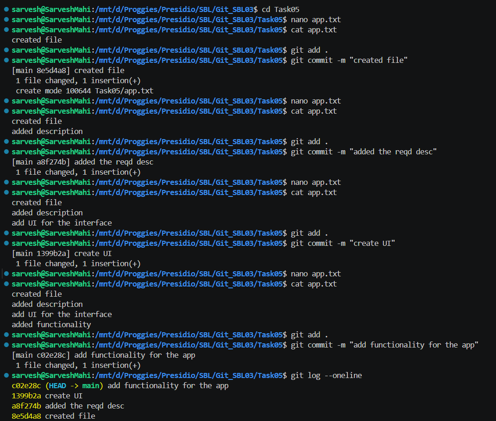
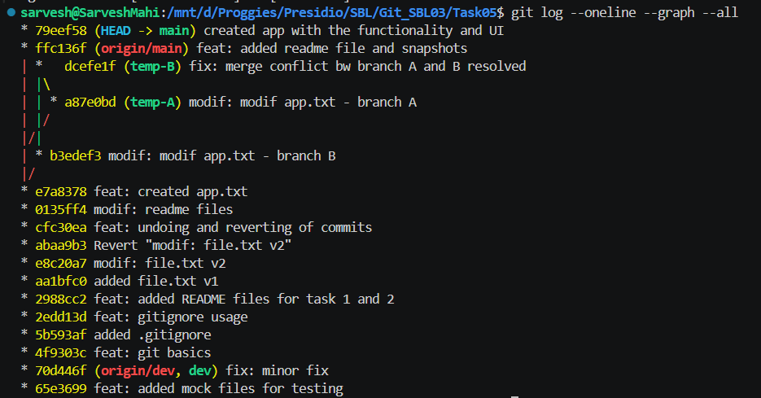
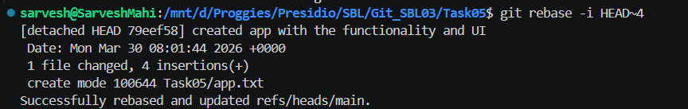

# 📘 Git Task 05 – Interactive Rebasing for Clean Commit History

## 🎯 Objective

The objective of this task is to use **interactive rebase** to clean up commit history by squashing, reordering, and improving commit messages.

---

## 🛠️ Steps Performed

---

### 1. Create Multiple Commits

A series of commits were created with incremental changes to `app.txt`:

```bash
nano app.txt
git add .
git commit -m "created file"

nano app.txt
git add .
git commit -m "added the reqd desc"

nano app.txt
git add .
git commit -m "create UI"

nano app.txt
git add .
git commit -m "add functionality for the app"
```

📸 Output:



---

### 2. Verify Commit History (Before Rebase)

```bash
git log --oneline
```

👉 Example history:

```text
add functionality for the app
create UI
added the reqd desc
created file
```

📸 Output:



---

### 3. Run Interactive Rebase

To clean up the last 4 commits:

```bash
git rebase -i HEAD~4
```

In the interactive editor:

```text
pick <commit1> created file
squash <commit2> added the reqd desc
squash <commit3> create UI
squash <commit4> add functionality for the app
```

👉 This combines all commits into one.

---

### 4. Edit Commit Message

The combined commit message was rewritten to:

```text
created app with the functionality and UI
```

---

### 5. Verify Clean History (After Rebase)

```bash
git log --oneline --graph --all
```

👉 Result:

* Multiple commits were squashed into a single clean commit

📸 Output:



---

## ✅ Outcome

* Created multiple commits with incremental changes
* Used interactive rebase to squash commits
* Improved commit message clarity
* Achieved a clean and professional commit history

---

## 🧠 Key Learnings

* `git rebase -i` allows rewriting commit history interactively
* Squashing combines multiple commits into one meaningful commit
* Clean history improves readability and collaboration
* Commit messages should clearly describe the overall change

---

## 🔥 Why Squashing is Important

### ❌ Before Squashing (Messy History)

```text
fix typo
added desc
update UI
final fix
```

👉 Hard to understand overall purpose

---

### ✅ After Squashing (Clean History)

```text
feat: created app with UI and functionality
```

👉 Clear, concise, and professional

---

## ⚠️ Important Notes

* Interactive rebase rewrites commit history
* If changes are already pushed, use:

```bash
git push --force
```

⚠️ Use with caution in team environments

---

## 🚀 Conclusion

Interactive rebasing is a powerful tool to maintain a clean and meaningful commit history. Squashing related commits into a single commit helps improve readability, simplifies code reviews, and ensures a professional Git workflow.

---
