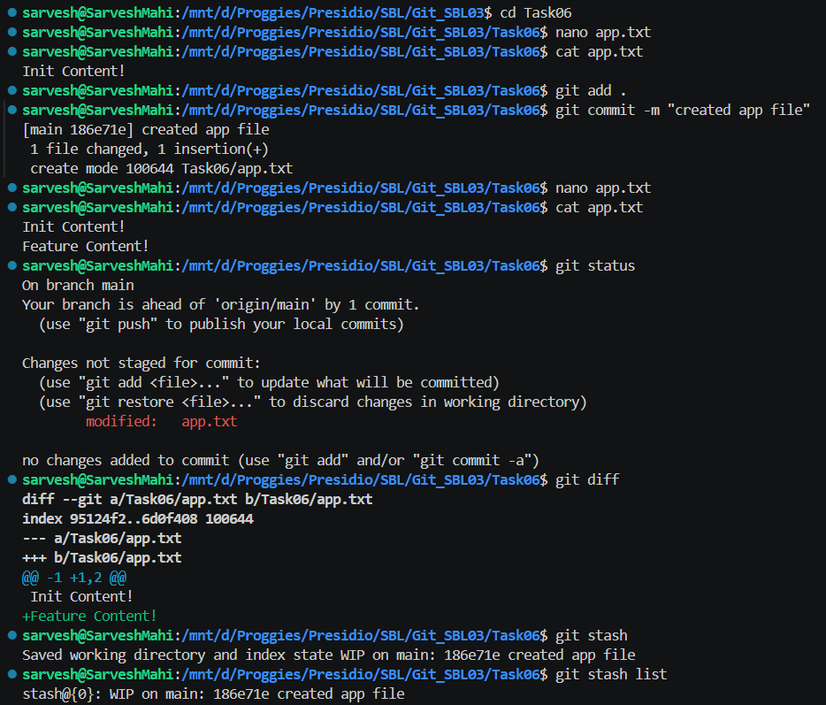
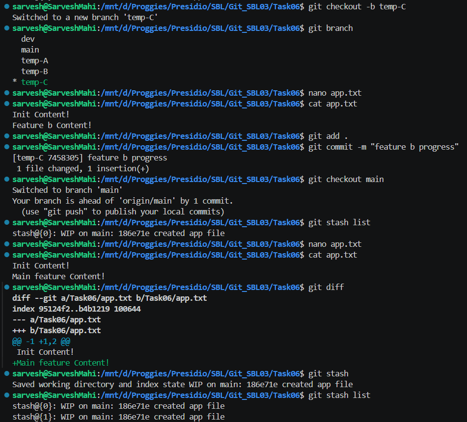
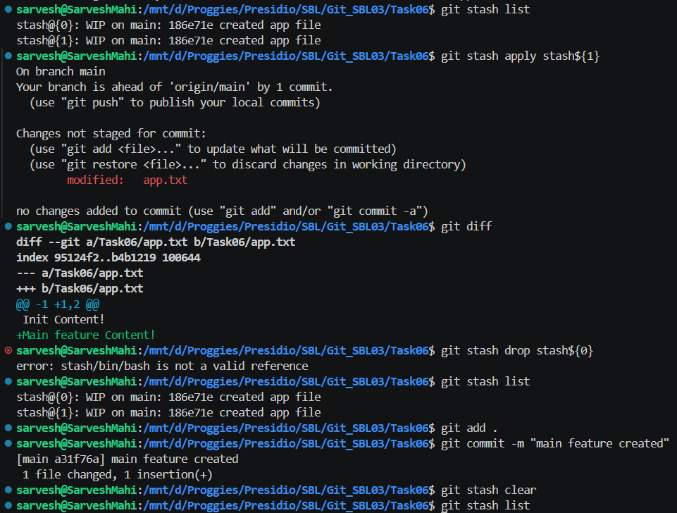

# 📘 Git Task 06 – Stashing Changes for Context Switching

## 🎯 Objective

The objective of this task is to learn how to use **Git stash** to temporarily save uncommitted changes, switch contexts (branches), and later reapply those changes safely.

---

## 🛠️ Steps Performed

---

### 1. Create Base File and Commit

A base file `app.txt` was created and committed:

```bash
nano app.txt
cat app.txt
```

Content:

```text
Init Content!
```

Then committed:

```bash
git add .
git commit -m "created app file"
```

---

### 2. Make Changes Without Committing

The file was modified:

```text
Init Content!
Feature Content!
```

Checked status:

```bash
git status
git diff
```

👉 These changes were **not committed**

---

### 3. Stash the Changes

```bash
git stash
```

👉 Output:

* Changes saved temporarily
* Working directory became clean

Verify:

```bash
git stash list
```

📸 Output:



---

### 4. Switch Branch and Work

Created and switched to a new branch:

```bash
git checkout -b temp-C
```

Made changes and committed:

```bash
git add .
git commit -m "feature b progress"
```

---

### 5. Return to Main Branch

```bash
git checkout main
```

Made another change:

```text
Init Content!
Main feature Content!
```

Stashed again:

```bash
git stash
```

Now multiple stashes exist.

---

### 6. View and Manage Stashes

```bash
git stash list
```

👉 Example:

```text
stash@{0}
stash@{1}
```

---

### 7. Apply a Specific Stash

```bash
git stash apply stash@{1}
```

👉 Restores changes without removing stash

Verified using:

```bash
git status
git diff
```

📸 Output:



---

### 8. Commit Applied Changes

```bash
git add .
git commit -m "main feature created"
```

---

### 9. Remove and Clear Stashes

Remove specific stash:

```bash
git stash drop stash@{0}
```

Clear all stashes:

```bash
git stash clear
```

Verify:

```bash
git stash list
```

📸 Output:



---

## ✅ Outcome

* Successfully stashed uncommitted changes
* Switched branches without losing work
* Reapplied stashed changes using `git stash apply`
* Managed multiple stashes using list, drop, and clear

---

## 🧠 Key Learnings

* `git stash` temporarily saves uncommitted work
* `git stash pop` restores and removes stash
* `git stash apply` restores without deleting
* Multiple stashes can be managed using `git stash list`
* Useful for context switching without committing incomplete work

---

## ⚠️ Important Notes

* Stash is local and not pushed to remote
* By default, only tracked files are stashed
* Use `git stash -u` to include untracked files

---

## 🚀 Conclusion

Git stash is a powerful feature for temporarily saving work in progress. It enables developers to switch tasks efficiently without committing incomplete code, making it essential for real-world development workflows.

---
