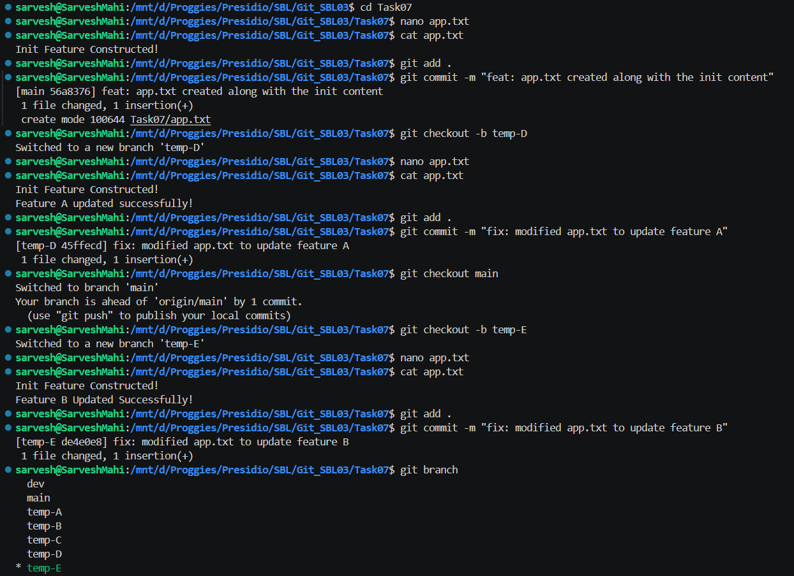
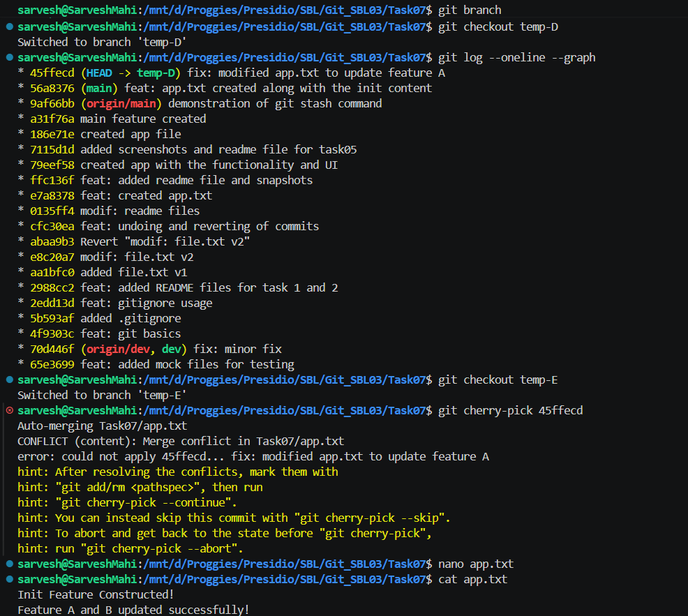
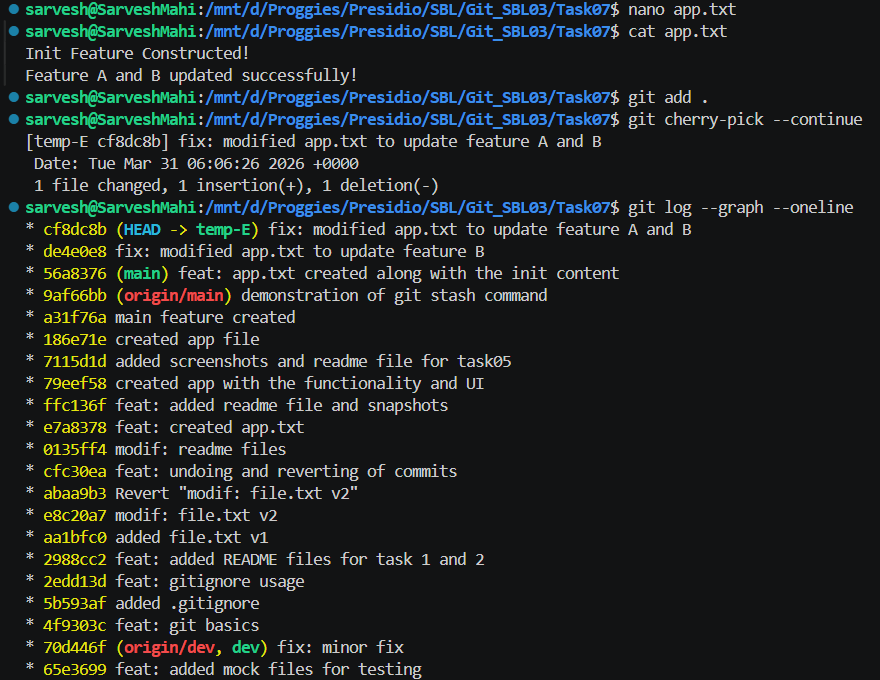

# 📘 Git Task 07 – Cherry-Picking Commits Between Branches

## 🎯 Objective

The objective of this task is to selectively apply a specific commit from one branch to another using `git cherry-pick`, and handle any conflicts that arise during the process.

---

## 🛠️ Steps Performed

---

### 1. Create Base Commit

A base file `app.txt` was created in the `main` branch:

```bash
nano app.txt
cat app.txt
```

Content:

```text
Init Feature Constructed!
```

Committed:

```bash
git add .
git commit -m "feat: app.txt created along with the init content"
```

---

### 2. Create First Branch (temp-D) and Modify

Created branch `temp-D`:

```bash
git checkout -b temp-D
```

Modified file:

```text
Init Feature Constructed!
Feature A updated successfully!
```

Committed:

```bash
git add .
git commit -m "fix: modified app.txt to update feature A"
```

---

### 3. Create Second Branch (temp-E) and Modify

Switched back and created `temp-E`:

```bash
git checkout main
git checkout -b temp-E
```

Modified file:

```text
Init Feature Constructed!
Feature B Updated Successfully!
```

Committed:

```bash
git add .
git commit -m "fix: modified app.txt to update feature B"
```

📸 Output:



---

### 4. Identify Commit to Cherry-Pick

Switched to `temp-D` and retrieved commit hash:

```bash
git log --oneline
```

Example:

```text
45ffecd fix: modified app.txt to update feature A
```

---

### 5. Cherry-Pick Commit into temp-E

```bash
git checkout temp-E
git cherry-pick 45ffecd
```

👉 Conflict occurred:

```text
CONFLICT (content): Merge conflict in app.txt
```

📸 Output:



---

### 6. Resolve Conflict

Opened file:

```bash
nano app.txt
```

Resolved content:

```text
Init Feature Constructed!
Feature A and B updated successfully!
```

Marked as resolved:

```bash
git add .
git cherry-pick --continue
```

---

### 7. Verify Commit History

```bash
git log --oneline --graph
```

📸 Output:



---

## ✅ Outcome

* Successfully created two branches with different changes
* Cherry-picked a specific commit from one branch to another
* Handled merge conflict manually
* Verified commit history after cherry-pick

---

## 🧠 Key Learnings

* `git cherry-pick` applies specific commits across branches
* Conflicts can occur if the same file/lines are modified
* Manual resolution is required before completing the operation
* Cherry-pick creates a new commit with a different hash

---

## ⚠️ Important Notes

* Cherry-pick is useful for selective changes (e.g., bug fixes)
* Avoid overusing it as it can duplicate commits
* Always verify history after cherry-pick

---

## 🚀 Conclusion

This task demonstrates how to selectively transfer changes between branches using `git cherry-pick`. It is especially useful in real-world scenarios like applying bug fixes across multiple branches without merging entire features.

---
