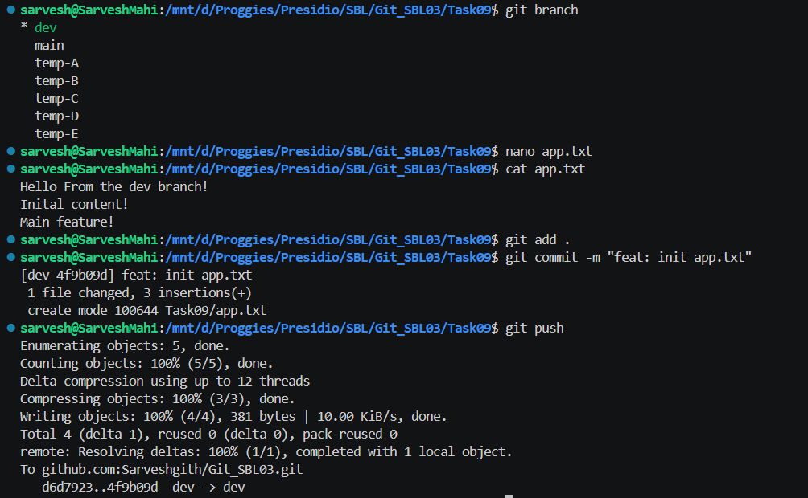
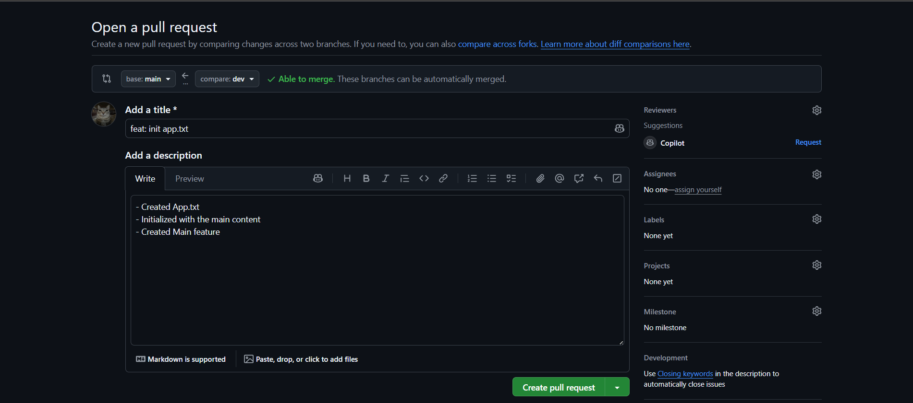
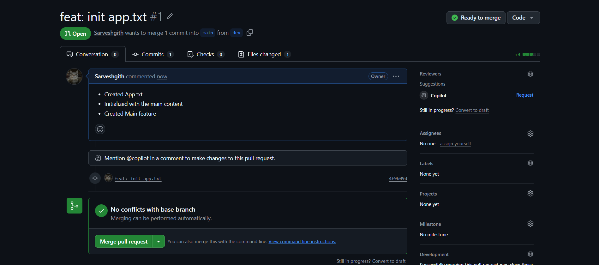
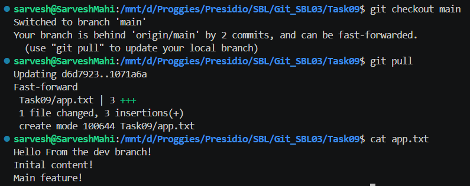

# 📘 Git Task 09 – Working with Remote Repositories and Collaboration

## 🎯 Objective

The objective of this task is to simulate a real-world collaborative Git workflow using a remote repository. This includes pushing code, working with feature branches, creating pull requests, reviewing changes, and syncing updates locally.

---

## 🛠️ Steps Performed

---

### 1. Push Local Repository to Remote

A local repository was initialized and connected to a remote repository on GitHub. Changes were committed and pushed to the remote.

```bash
git add .
git commit -m "feat: init app.txt"
git push
```

📸 Output:



---

### 2. Work on Feature Branch (`dev`)

Switched to the `dev` branch and created a new file:

```bash
nano app.txt
cat app.txt
```

Content:

```text
Hello From the dev branch!
Initial content!
Main feature!
```

Committed and pushed:

```bash
git add .
git commit -m "feat: init app.txt"
git push
```

---

### 3. Create Pull Request on GitHub

A Pull Request (PR) was created to merge changes from `dev` into `main`.

* Base branch: `main`
* Compare branch: `dev`
* Title: `feat: init app.txt`
* Description included:

  * Created app.txt
  * Initialized with main content
  * Added main feature

📸 Output:



---

### 4. Code Review Simulation

The PR was reviewed (self-reviewed in this case), ensuring:

* Code correctness
* Proper commit message
* No conflicts

📸 Output:



---

### 5. Merge Pull Request

The PR was successfully merged into the `main` branch on GitHub.

* Verified that there were no conflicts
* Used **Merge Pull Request** option

---

### 6. Pull Changes to Local Repository

After merging, local repository was updated:

```bash
git checkout main
git pull
```

---

### 7. Verify Final Output

```bash
cat app.txt
```

Output:

```text
Hello From the dev branch!
Initial content!
Main feature!
```

📸 Output:



---

## ✅ Outcome

* Successfully pushed local repository to remote
* Created and worked on a feature branch
* Opened and reviewed a Pull Request
* Merged changes into main branch
* Synced updated changes back to local

---

## 🧠 Key Learnings

* Feature branches help isolate development work
* Pull Requests enable code review and collaboration
* Remote repositories act as a central source of truth
* `git pull` keeps local repo in sync with remote

---

## ⚠️ Important Notes

* Always pull latest changes before starting new work
* Avoid committing directly to `main`
* Use meaningful commit messages
* PR reviews improve code quality in teams

---

## 🚀 Conclusion

This task demonstrates a complete Git collaboration workflow using remote repositories. It highlights best practices such as feature branching, pull requests, and syncing changes, which are essential in real-world team development environments.

---
