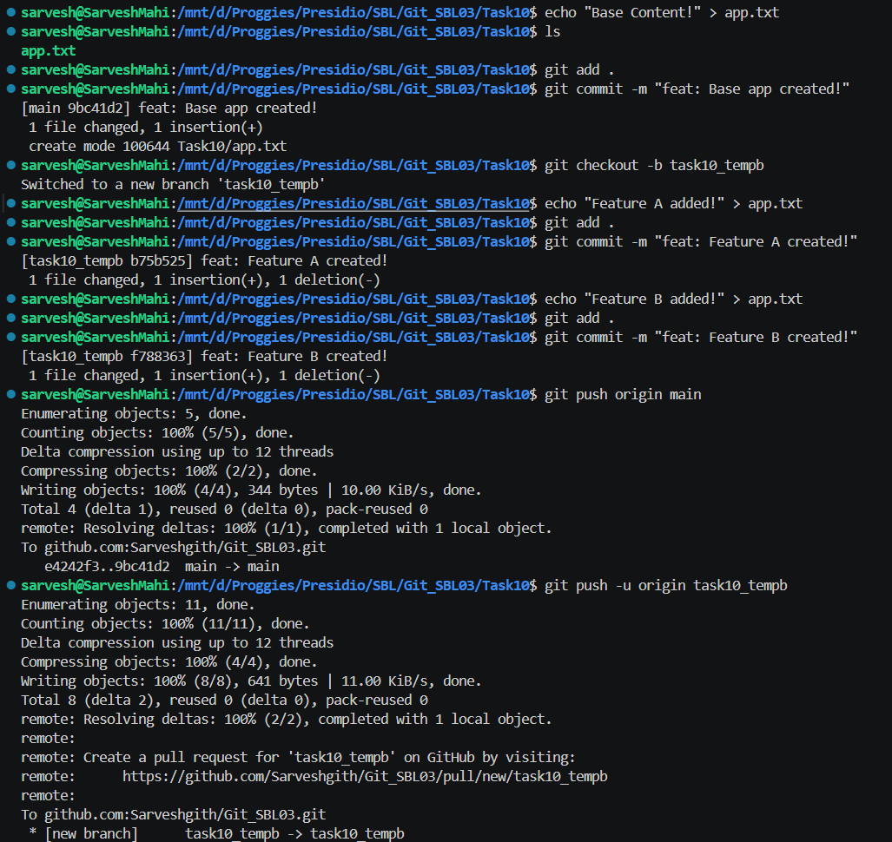
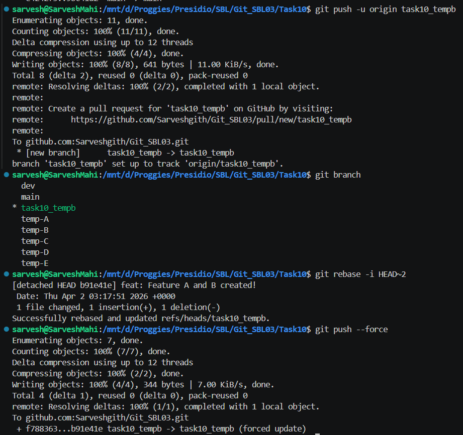
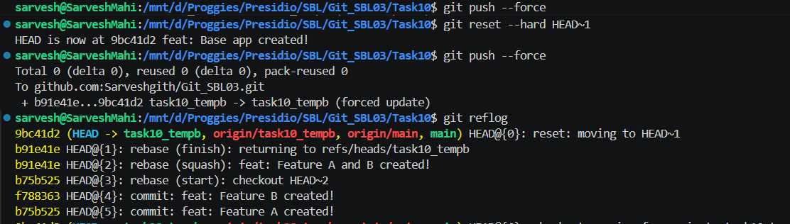
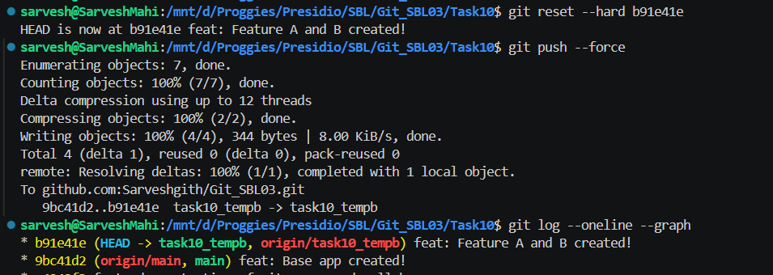

# 📘 Git Task 10 – Comprehensive Workflow with Forced Pushes and Recovery

## 🎯 Objective

The objective of this task is to simulate an advanced Git workflow involving:

* Multi-branch development
* Rewriting commit history using rebase
* Performing a forced push
* Recovering lost commits using `git reflog`

---

## 🛠️ Steps Performed

---

### 1. Create Base Commit on Main

A base file `app.txt` was created and committed:

```bash
echo "Base Content!" > app.txt
git add .
git commit -m "feat: Base app created!"
```

---

### 2. Create Feature Branch and Add Commits

Created a new branch:

```bash
git checkout -b task10_tempb
```

Added multiple commits:

```bash
echo "Feature A added!" > app.txt
git add .
git commit -m "feat: Feature A created!"

echo "Feature B added!" > app.txt
git add .
git commit -m "feat: Feature B created!"
```

---

### 3. Push Branch to Remote

```bash
git push -u origin task10_tempb
```

📸 Output:



---

### 4. Rewrite History using Interactive Rebase

```bash
git rebase -i HEAD~2
```

👉 Squashed commits:

```text
pick feat: Feature A created!
squash feat: Feature B created!
```

👉 Result: single clean commit

---

### 5. Force Push After Rebase

```bash
git push --force
```

👉 Required because commit history was rewritten

📸 Output:



---

### 6. Simulate Mistake (Hard Reset + Force Push)

```bash
git reset --hard HEAD~1
git push --force
```

👉 This removed the latest commit from history

---

### 7. Recover Lost Commit Using Reflog

```bash
git reflog
```

📸 Output:



Identified lost commit:

```text
b91e41e feat: Feature A and B created!
```

---

### 8. Restore Lost Commit

```bash
git reset --hard b91e41e
git push --force
```

👉 Commit successfully restored

---

### 9. Verify Final History

```bash
git log --oneline --graph
```

📸 Output:



---

## ✅ Outcome

* Successfully created a multi-branch workflow
* Rewrote commit history using interactive rebase
* Performed a forced push after history changes
* Simulated accidental commit loss
* Recovered lost commit using `git reflog`

---

## 🧠 Key Learnings

* `git push --force` overwrites remote history
* `git rebase` rewrites commit history (changes commit hashes)
* `git reflog` tracks all HEAD movements (even deleted commits)
* Lost commits can be recovered if they exist in reflog

---

## ⚠️ Important Notes

* Never use `git push --force` on shared branches like `main`
* Prefer `git push --force-with-lease` for safer force pushes
* Always inform team members before rewriting history
* Reflog is local — recovery is only possible if commit exists locally

---

## 🚀 Best Practices for Teams

* Use feature branches for development
* Avoid rewriting public history
* Use pull requests for merging
* Communicate before performing force pushes
* Keep commits clean using rebase before pushing

---

## 🚀 Conclusion

This task demonstrates a complete advanced Git workflow involving history rewriting, force pushing, and recovery. It highlights the risks associated with force pushes and the importance of `git reflog` as a powerful recovery tool in real-world scenarios.

---
